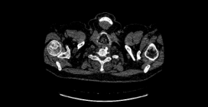
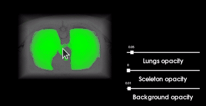

### itk_vtk_science_visualization
Example of 3D processing of chest CT data

**3D image processing tool**: [ITK](https://itk.org/Doxygen/html/index.html)   
**3D image visualisation tool**: [VTK](https://vtk.org/)  
**Tutorial**: [VTK_tutorial](https://github.com/FenixFly/VTK_tutorial)  
**Data**: [Pulmonary Fibrosis Progression](https://www.kaggle.com/competitions/osic-pulmonary-fibrosis-progression/data?select=test) - DICOM data series

Source                      |  3d Segmnentation
:-------------------------:|:-------------------------:
  | 
